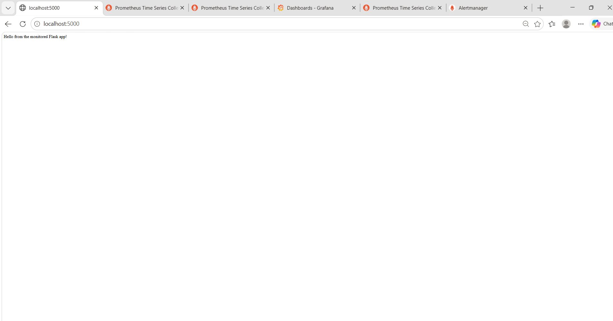
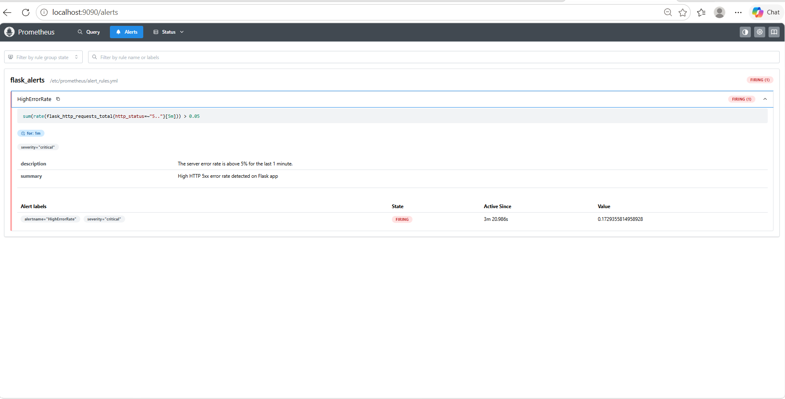

# Flask Observability & Monitoring Suite


A containerized observability stack for a Flask application. It combines **Prometheus** (metrics and alert rules), **Alertmanager** (alert grouping and routing), **node-exporter** (host metrics) and **Grafana** (dashboards), all started with one `docker-compose up` command.

---

## Table of Contents

- [Architecture](#architecture)
- [Features](#features)
- [Tech Stack](#tech-stack)
- [Project Structure](#project-structure)
- [Getting Started](#getting-started)
- [Metrics Exposed](#metrics-exposed)
- [Alerting](#alerting)
- [Example PromQL Queries](#example-promql-queries)
- [Grafana Dashboards](#grafana-dashboards)
- [Testing the Alerts](#testing-the-alerts)
- [Troubleshooting](#troubleshooting)
- [Future Improvements](#future-improvements)
- [What I Learned](#what-i-learned)
- [Author](#author)

---

## Architecture

```
+------------------------------------------------------------------------+
|                         Docker Compose Network                         |
|                                                                        |
|  +-------------+   /metrics    +--------------+   alerts  +-----------+ |
|  |  Flask App  | <------------ |  Prometheus  | --------> |Alertmanager| |
|  |  :5000      |   scrape      |  :9090       |           |  :9093    | |
|  +-------------+               |  + alert     |           +-----------+ |
|                                |    rules     |                         |
|  +-------------+   /metrics    |              |                         |
|  | node-export | <------------ |              |                         |
|  |  :9100      |   scrape      +------+-------+                         |
|  +-------------+                      | PromQL                          |
|                                       v                                 |
|                                +--------------+                         |
|                                |   Grafana    |                         |
|                                |   :3000      |                         |
|                                +--------------+                         |
+------------------------------------------------------------------------+
```

**Data flow**

1. **Instrumentation:** the Flask app uses `prometheus-client` to expose HTTP metrics at `/metrics`.
2. **Host metrics:** node-exporter exposes host CPU, memory and disk metrics.
3. **Scraping:** Prometheus pulls metrics from the Flask app and node-exporter at a fixed interval.
4. **Alerting:** Prometheus evaluates alert rules and sends firing alerts to Alertmanager, which groups and routes them.
5. **Visualization:** Grafana uses Prometheus as a data source and renders dashboards from PromQL queries.

---

## Features

- Custom Flask HTTP metrics on a `/metrics` endpoint
- Host-level metrics (CPU, memory) with node-exporter
- Prometheus alert rule `HighErrorRate` for 5xx server errors (1-minute pending period)
- Alertmanager for alert grouping and routing
- Grafana dashboards for application traffic, error rate and infrastructure performance
- PromQL queries using `rate()` and regex filters on status codes
- Fully containerized and reproducible with Docker Compose

---

## Tech Stack

| Layer | Technology |
|---|---|
| Application | Python, Flask |
| Instrumentation | `prometheus-client` |
| Metrics storage and alert rules | Prometheus |
| Alert routing | Alertmanager |
| Host metrics | node-exporter |
| Visualization | Grafana |
| Containerization | Docker, Docker Compose |

---

## Project Structure

> Adjust file names below to match your repository.

```
prometheus-grafana-monitoring/
├── app/                      # Flask application and Dockerfile
├── prometheus/
│   ├── prometheus.yml        # Scrape configuration
│   └── alert_rules.yml       # Alert rules (HighErrorRate)
├── alertmanager/             # Alertmanager configuration
├── docker-compose.yml        # Runs the full stack
└── README.md
```

---

## Getting Started

### Prerequisites

- Docker
- Docker Compose
- Git

### 1. Clone the repository

```bash
git clone https://github.com/vivek65666/Monitoring-Logging-Projects.git
cd Monitoring-Logging-Projects/prometheus-grafana-monitoring
```

### 2. Start the stack

```bash
docker-compose up -d
```

Use `docker compose up -d` if your Docker version uses the plugin syntax.

### 3. Verify the containers

```bash
docker-compose ps
```

### 4. Access the services

| Service | URL | Notes |
|---|---|---|
| Flask app | http://localhost:5000 | Sample application |
| Flask metrics | http://localhost:5000/metrics | Raw Prometheus metrics |
| Prometheus | http://localhost:9090 | **Status > Targets** should show all targets UP; **Alerts** shows rule state |
| Alertmanager | http://localhost:9093 | Active and grouped alerts |
| node-exporter | http://localhost:9100/metrics | Host metrics |
| Grafana | http://localhost:3000 | Default login `admin` / `admin` (change on first login) |

### 5. Connect Grafana to Prometheus (if not already provisioned)

1. Go to **Connections > Data sources > Add data source > Prometheus**.
2. Set the URL to `http://prometheus:9090`.
3. Click **Save & test**.

### 6. Stop the stack

```bash
docker-compose down
```

---

## Metrics Exposed

| Metric | Source | Description |
|---|---|---|
| `flask_http_requests_total` | Flask app | Total HTTP requests, labelled by method, endpoint and status code |
| `node_cpu_seconds_total` | node-exporter | Host CPU time by mode |
| `node_memory_MemAvailable_bytes` | node-exporter | Available host memory |

---

## Alerting

### Alert rule: `HighErrorRate`

Fires when the rate of 5xx responses stays above the threshold for **1 minute**.

> Example only. Copy the exact rule from your `prometheus/alert_rules.yml` so the README matches your code.

```yaml
groups:
  - name: flask-alerts
    rules:
      - alert: HighErrorRate
        expr: sum(rate(flask_http_requests_total{status=~"5.."}[1m])) > 0
        for: 1m
        labels:
          severity: critical
        annotations:
          summary: "High 5xx error rate on Flask app"
          description: "The Flask app is returning 5xx errors."
```

- `for: 1m` keeps the alert in **Pending** until the condition holds for a full minute, then it moves to **Firing**. This avoids alerts on brief spikes.
- Prometheus sends firing alerts to **Alertmanager**, which groups and routes them using its configuration file.

### Alert states

| State | Meaning |
|---|---|
| Inactive | Condition is false |
| Pending | Condition is true but the `for` duration has not passed |
| Firing | Condition has been true for the full `for` duration; sent to Alertmanager |

---

## Example PromQL Queries

**Request rate per second**

```promql
rate(flask_http_requests_total[5m])
```

**Request rate by endpoint**

```promql
sum by (endpoint) (rate(flask_http_requests_total[5m]))
```

**Error rate (4xx and 5xx)**

```promql
sum(rate(flask_http_requests_total{status=~"4..|5.."}[5m]))
```

**Host CPU usage (%)**

```promql
100 - (avg(rate(node_cpu_seconds_total{mode="idle"}[5m])) * 100)
```

**Host memory usage (%)**

```promql
100 * (1 - node_memory_MemAvailable_bytes / node_memory_MemTotal_bytes)
```

> Label names (`endpoint`, `status`) depend on your app code. Adjust if yours differ.

---

## Grafana Dashboards

- **Flask Request Rate:** requests per second by method and endpoint.
- **Flask Error Rate:** 4xx and 5xx responses over time.
- **Infrastructure:** host CPU and memory from node-exporter.

### Dashboard preview

<!-- Save screenshots in a screenshots/ folder and uncomment the lines below -->
<!--  -->
<!--  -->

---

## Testing the Alerts

1. Generate normal traffic:

   ```bash
   for i in $(seq 1 100); do curl -s -o /dev/null http://localhost:5000/; done
   ```

2. Generate 5xx errors. Hit an endpoint in your app that returns a 500, for example:

   ```bash
   for i in $(seq 1 60); do curl -s -o /dev/null http://localhost:5000/<your-error-endpoint>; sleep 1; done
   ```

3. Open **http://localhost:9090/alerts** and watch `HighErrorRate` go from **Inactive** to **Pending** to **Firing**.
4. Open **http://localhost:9093** to see the alert received by Alertmanager.

---

## Troubleshooting

| Problem | Fix |
|---|---|
| Target shows **DOWN** | Check the target name and port in `prometheus.yml` and run `docker-compose ps` |
| Grafana shows **No data** | Confirm the data source URL is `http://prometheus:9090` and generate some traffic |
| Alert never fires | Check the rule expression in the Prometheus **Graph** tab and confirm 5xx responses are actually produced |
| Alertmanager shows no alerts | Confirm `alerting` and `rule_files` are set in `prometheus.yml` |
| Config errors on startup | Run `docker-compose logs <service-name>` |
| Port already in use | Stop the conflicting process or change the host port in `docker-compose.yml` |
| Changes not applied | Rebuild with `docker-compose up -d --build` |

---

## 📐 Architecture Overview


## 📊 Project Visualizations & Validation

### 1. Application Health (Flask)


### 2. Grafana Dashboards
**HTTP Request Rate & Status:**


**Infrastructure & Node Exporter:**


### 3. Alert Lifecycle & Routing



---

## Future Improvements

- [ ] Add alert notifications (email or Slack) in Alertmanager
- [ ] Add a latency histogram and p95 latency alert
- [ ] Provision Grafana data sources and dashboards as code
- [ ] Persist Prometheus and Grafana data with Docker volumes
- [ ] Deploy on Kubernetes using the `kube-prometheus-stack` Helm chart

---

## What I Learned

- Prometheus pull-based scraping and target configuration
- Instrumenting a Python app with custom metrics
- Writing alert rules and understanding Pending vs Firing states
- Configuring Alertmanager for grouping and routing
- Building Grafana dashboards with PromQL
- Orchestrating a multi-container stack with Docker Compose

---

## Author

**Vivek C Raj**

- GitHub: [vivek65666](https://github.com/vivek65666)
- LinkedIn: [vivek-c-raj](https://www.linkedin.com/in/vivek-c-raj/)
